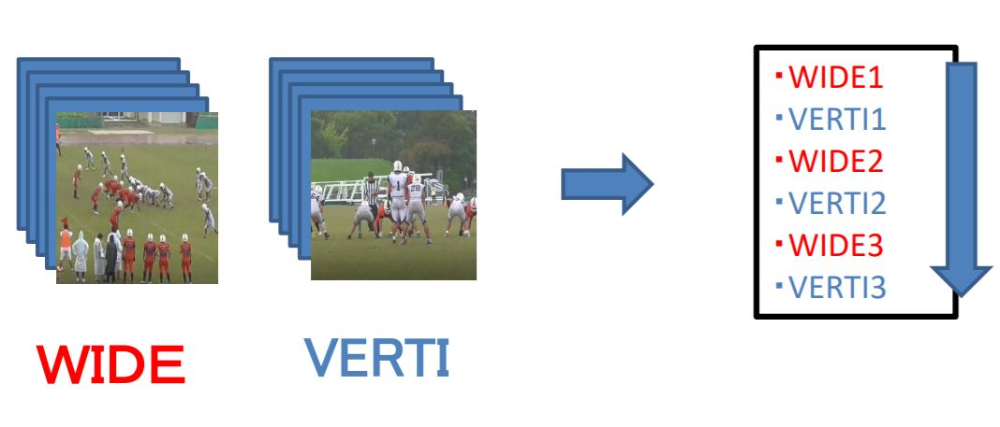

FootballVideoEdit_withDL
==========

アメフトの試合のビデオの仕分けをディープラーニングで自動で行う試み．

現在はあまりよい結果は得られていないが，アイデアと検証結果を述べる．

# 目標

異なる視点からの2つの動画を比較し，プレーの同一判定を行う．

# 背景

アメリカンフットボールでは，他チームの試合の動画から他チームのプレーや選手を分析するスカウティングという作業をよく行う．
その際に，試合の動画を見やすく編集することは重要である．

アメフトの試合では，スカウティングがしやすいようにプレーごとに区切って動画を撮影することが多い．
また，異なる視点から別々のカメラで撮影することが好ましい．
今回，その2つの動画を`wide`(横)と`vertical`(正面)と称する．
この`wide`と`vertical`の動画ファイル群を，
以下の図のように同じプレイを`wide`と`vertical`交互に見れるようにまとめることを考える．

  

この作業を簡潔化するために，`wide`と`vertical`の2つの動画を比較し，プレーの同一判定を行いたいと考えた．

# 2つの動画の同一判定

深層距離学習(Deep Metric Learning)を用いて，`wide`と`vertical`の2つの動画のプレー同一判定を行う．

`wide`と`vertical`の2つの動画を入力し，[0, 1]の値を出力する．
この出力値が1に近ければ一致，0に近ければ不一致とする．

モデルはSiamese Networksの原理を利用したものとし，https://gist.github.com/hlamba28/529de1c24c2a1bb318701d7469e47697#file-siamese_model_one_shot-py を参照した．

(参考：https://towardsdatascience.com/one-shot-learning-with-siamese-networks-using-keras-17f34e75bb3d)

```
python deeptest.py
```

を実行することで，モデルの学習と検証を行うことができる．
その際，入力データは特殊な前処理で準備する必要がある．

# 入力データの形式と前処理の方法

入力データは，`wide`と`vertical`の動画のペアに対し，一致(1)/不一致(0)の教師ラベルを付けるという構成で用意する．

```
入力データ, 教師ラベル
(wide1, vertical1), (target1)
(wide2, vertical2), (target2)
       :
```

動画は全て(Frame, Width, Height) = (150, 200, 200)のグレースケール動画に統一する．

このような訓練データセットに前処理するため，`MakePairData.py`を用意している．

まず，以下のようなフォルダ構成で試合の動画ファイルを準備する：

```
dataset
│ 
├── 試合1
│    ├── 1Q
│    │    ├── 1.mp4
│    │    ├── 1v.mp4
│    │         :
│    ├── 2Q
│    ├── 3Q
│    └── 4Q
│
├── 試合2
│    ├── 1Q
│    │    ├── 1.mp4
│    │    ├── 1v.mp4
│    │         :
│    ├── 2Q
│    ├── 3Q
│    └── 4Q
│    :
```

`dataset`フォルダ内に2つのフォルダ階層(試合，クォーター)があり，その中に動画ファイルがある構成である．
また，動画は`wide`は`1.mp4`，`2.mp4`，...と数字のみのファイル名，`vertical`は`1v.mp4`，`2v.mp4`，...と「数字+`v`」というファイル名にし，
**同じ数字の動画どうしがプレーが同じ**とする．

次に，`MakePairData.py`の`main`部分において，


```python:MakePairData.py
if __name__ == '__main__':
    # フォルダパス指定
    folder_path = "D:/2018mp4/"
    output_path = "D:/VE/TRANS_DATA"

    folders = glob(folder_path + "**/**")
    print(folders)
    for folder in folders:
        MakePairData(folder, output_path)
```

の`folder_path`に先程の`dataset`のパスを指定し，

```
python MakePairData.py
```

を実行することで，動画を前処理をすることができる．
前処理された動画は`npy`ファイルとして`output_path`のフォルダに保存される．

# 結果

テストデータを推定させた結果を示す．

```
score:[[0.49962726]
 [0.49962726]
 [0.49962726]
 [0.49962726]
       :
```

どのペアデータに対しても0.49962726しか返さないため，
ネットワークが一致/不一致どちらとも判定できていないという結果になった．

原因として，入力データはただの動画であるため，この同一判定というタスクに対してネットワークが理解できず，
ネットワークの特徴抽出がうまくいかなかったと考えられる．
これを解決するためには，選手をトラッキングしてフィールドでの二次元座標に落とし込むなど，
動画を同一判定用の特徴量に変換させる必要があると考えた．
